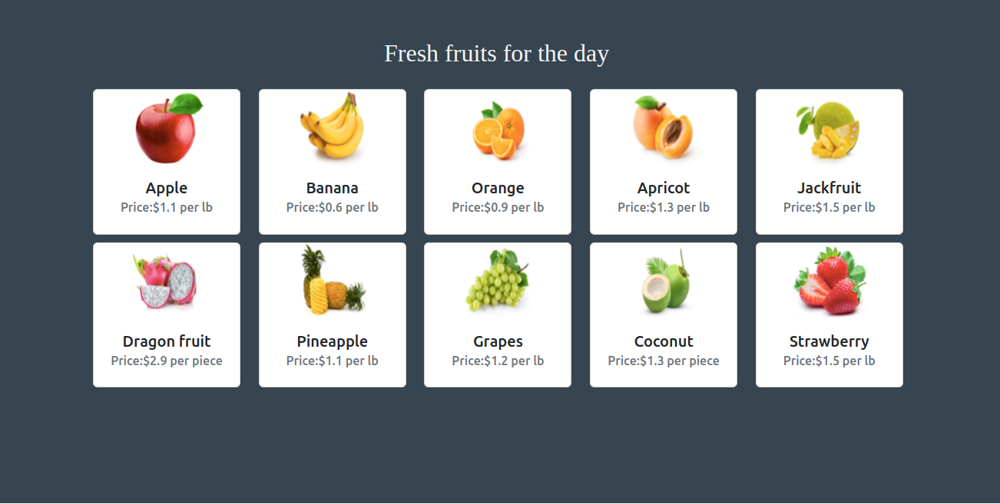

# Fruit Fantasy

## Context

Fruit Fantasy is a local fruit vendor in San Francisco that launched an app that lets its customers view the fresh fruits offered daily. They wanted to serve their customers better and offer the best in terms of quality, benefits, flavor, and taste. 

As a first step, design a web page using TypeScript to display the fresh fruits from the database using fetch API. The fruits must be displayed as cards, ensuring the content is easy to scan. 

### Problem Statement

Fruit Fantasy app allows its customers to view the fresh fruits offered on daily basis.​

Build a web page using TypeScript which displays the fruits from the database using fetch API. The preview of the web page should resemble as the image below:

### Tasks

The Solution for this challenge can be done in 6 steps.

#### Step 1:

- Add header in `index.html` file to specify the title "Fresh fruits for the day" .​
- Add a 
 container whose content should be dynamically loaded with the fruits.​
- Styles can be added inside `public/style.css` file​
- Give the path as `public/js/app.js` inside the script tag of the `index.html`.​

#### Step 2:
- Create a global `container` constant of HTMLElement type to represent `
` element.​
- Create an object type called `Fruit` with the required attributes to define the fruit.​

#### Step 3:
- Define `getFruits()` to retrieve all the fruits from the JSON server using fetch API `GET` method
- Define successful promise callback which converts the response body text to json object and return promise as result.
- Define successful promise callback which calls `transform()` method by passing the json object as argument. 

#### Step 4:
- Define `transform()` method which loops through each fruit data retrieved as response to create a new object called `transformedFruit` that mirrors the object `Fruit` by mapping individual properties.​
- Within `transform()` method, call `showFruits()` method and pass `transformedFruit` as an argument to it.​

#### Step 5:

- Create a string object which contains HTML code to display each fruit as a card inside `showFruits()`  method.​
    - Use bootstrap class to style the card. ​
    - Additional styling can be provided inside `public/style.css`.​
- Append this string to the global `container` constant using `innerHTML` property.​

#### Step 6:

- Invoke `getFruits()` method globally to display the fruits when the page is first loaded.

### Details
Fonts used:
- 'Times New Roman', 'Times', 'serif' (Heading)

Color codes used:
- Gray (Body background)
- whitesmoke (Heading)

### Instructions

- Open the terminal in the root directory.
- Give the command `tsc` in the terminal to compile `.ts` files. (No need to specify the path with file name(s) while giving `tsc` command). 
- Verify that `app.js` file is created inside `public/js` folder.
- Start the json-server by giving the command `json-server fruits.json`
- Run the `index.html` with live server which displays the fruits as cards.
